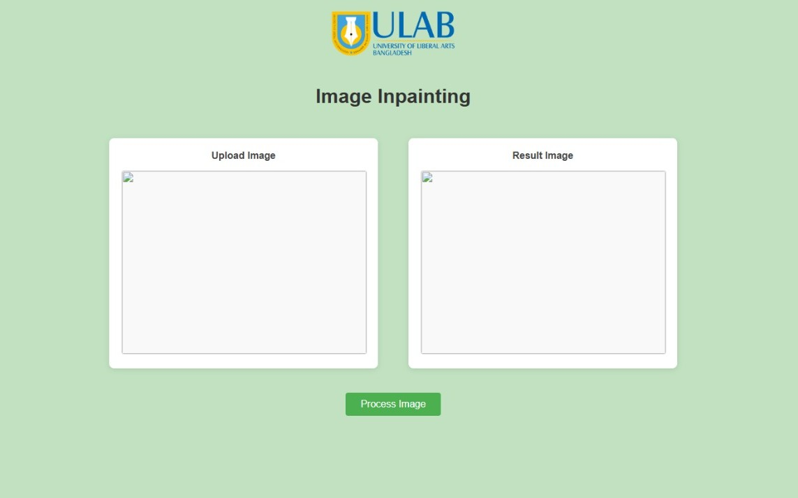
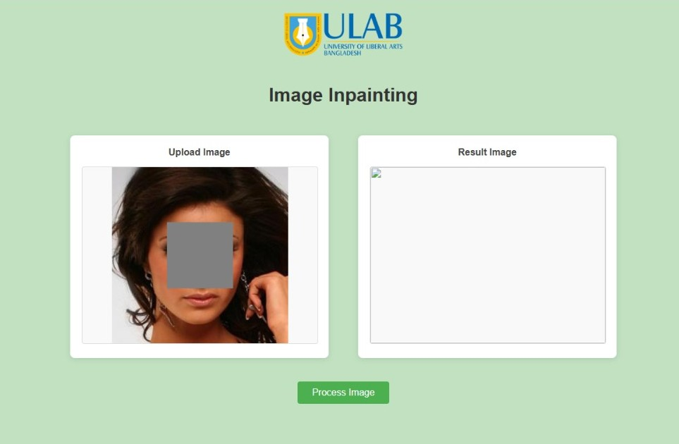
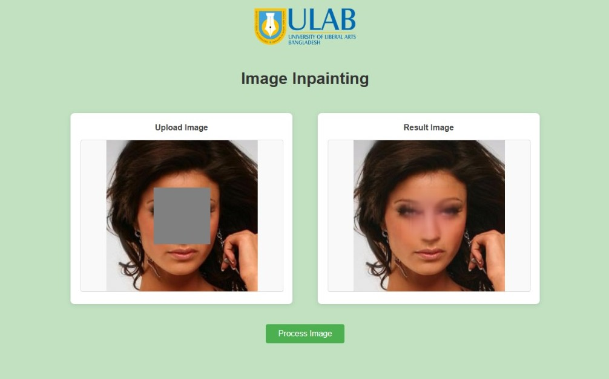

# Image-painting-using-GAN-and-U-Net

We developed a **high-resolution image inpainting system** using a hybrid deep learning approach—**U-Net as the generator** for structure reconstruction and **GAN as the discriminator** for realistic textures.
A **web app** is integrated for users to upload damaged images and receive real-time restorations, useful for **old photo recovery** and **image repair**.

---

## 🛠️ Development Environment

* **Platform:** Google Colab
* **Language:** Python
* **Framework:** PyTorch
* **Web Deployment:** Flask + Ngrok
* **Data Storage & Checkpoints:** Google Drive

---

## 📂 Dataset

We used the **CelebA-HQ (256×256 resolution)** dataset, downloaded via **KaggleHub** in Google Colab.
The dataset contains high-quality human face images, ideal for training image inpainting models.

* **Training Set:** 24,000 images
* **Testing Set:** 6,000 images

---

## 🧠 Model Architecture

* **Generator:** U-Net-based architecture to reconstruct missing regions.
* **Discriminator:** CNN-based model with **Spectral Normalization** for generating realistic textures.

### Loss Functions:

* **Adversarial Loss (BCELoss)** – encourages realism
* **Pixel-wise L1 Loss** – ensures accurate reconstruction
* **Gradient Penalty** – stabilizes GAN training

---

## 🚀 Training Details

* **Environment:** Google Colab with GPU support
* **Custom Dataset Loader:** Applies **random square masks** to simulate missing image regions
* **Training Strategy:**

  * Generator fills missing regions
  * Discriminator distinguishes between real and generated images
  * Both trained together in a **GAN training loop**
* **Output:** Checkpoints and generated results saved in **Google Drive**

---

## 🌐 Web Application Deployment

We deployed the trained model via a **Flask web application** and used **Ngrok** to expose it publicly from Colab.

**Web App Features:**

* Upload damaged images
* Receive real-time inpainted results

#### 📸 Web App Homepage

#### 📸 Image Upload Section

#### 📸 Sample Inpainting Result

---

## 📈 Performance Comparison

The model demonstrates **high visual fidelity** and **realistic texture generation**, outperforming baseline inpainting methods on multiple image types.

---

## 🎯 Applications

* Repair damaged images
* Restore old photographs
* General image inpainting for high-resolution images

---
